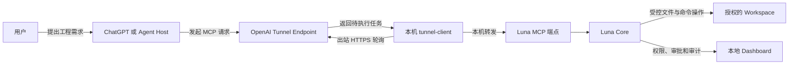

# Luna Unlimited

[](LICENSE)

让 ChatGPT 或其他兼容 MCP 的 Agent，在用户授权和本地安全策略约束下，读取、创建、修改并验证本机工程。

Luna Unlimited 是一个 **AI-neutral / vendor-neutral Local Agent Capability Runtime**。它不是网页逆向代理，也不转发 ChatGPT Cookie；模型继续运行在原来的 Host 中，Luna 只负责把本机 workspace 的受控能力通过 MCP 暴露出去。

> [!IMPORTANT]
> 这是社区项目，不是 OpenAI 官方产品。Secure MCP Tunnel 和 `tunnel-client` 来自 OpenAI；Luna Unlimited 的本地 Core、工具、安全策略和 Dashboard 由本项目提供。

## 它解决什么问题

普通网页对话只能告诉你“应该怎样改代码”，不能直接在你的电脑上完成工程。Luna Unlimited 把这条链路补上：



网页端负责理解需求、规划和调用工具；本机负责限制目录、校验版本、执行文件操作和允许的开发命令。MCP Server 不需要公网端口，`tunnel-client` 通过出站 HTTPS 拉取任务并把结果送回 OpenAI。

## 当前可以做什么

- 浏览、分段读取和搜索工程文件；
- 完整读取同时返回正文与 SHA-256/mtime 元数据，兼容偏好文本或结构化结果的 Host；
- 获取 SHA-256 文件 revision，避免多个 Agent 互相覆盖；
- 原子创建或更新最多 50 个文件，失败时回滚；
- 创建、列出、恢复和删除非 Git 本地恢复点，恢复失败自动回滚；
- 使用 unified diff 原子修改、创建或删除最多 50 个文件，强制 SHA-256 并发保护并支持 dry-run；
- 创建目录、移动文件/目录，以及受审批保护、带 revision 的删除；
- 检查 PDF、Excel 和图片等二进制 Artifact，并通过 Host 文件参数导入、MCP resource link 导出；
- 受控安装 npm 依赖，强制禁用 lifecycle scripts；
- 将公开 GitHub 仓库安全、浅层、原子地克隆到 workspace 新目录；
- 运行白名单内的 Git、Go、npm build/test/lint/typecheck 命令；
- 命令侧项目发现不会越过授权 workspace：Git 仓库、npm manifest 和 Go module 必须位于授权边界内；
- 文件搜索不会继承 workspace 父目录仓库的 ignore 规则；
- 在本机 Dashboard 查看权限、运行状态、审批队列和审计日志；
- 拒绝绝对路径、`..`、符号链接逃逸、`.env`、私钥和常见凭据文件。

当前版本只向 Host 暴露 13 个按领域和风险边界组织的 MCP 工具；实际权限、审批和审计继续落在 26 个细粒度 Core Action 上：

| 分类 | 工具 |
| --- | --- |
| 能力发现 | `luna.capabilities` |
| Workspace | `workspace.read`, `workspace.write`, `workspace.manage` |
| 可靠补丁 | `code.patch` |
| Artifact | `artifact.read`, `artifact.import` |
| 恢复 | `checkpoint.read`, `checkpoint.write` |
| Git | `git.read`, `git.remote` |
| 工程执行 | `project.execute`, `project.dependencies` |

拥有多个子操作的工具接收一个严格类型的 `request` 对象。例如：

```json
{
  "request": {
    "operation": "text",
    "path": "src/index.js"
  }
}
```

`tools/list` 会把不同 operation 暴露为 `request.oneOf` 分支，因此模型仍能看到每个子操作的精确参数，而不是面对一个任意字符串路由器。

## 五分钟开始

运行环境：Windows 10/11 或主流 x64/arm64 Linux、Node.js 20 或更高版本，以及能够使用 OpenAI Secure MCP Tunnel 与 ChatGPT Developer mode 的账号/工作区。

Windows：

```powershell
git clone https://github.com/terrywang1985/luna_unlimited.git
cd luna_unlimited

# 安装 npm 依赖、下载官方 tunnel-client、校验 SHA-256，并创建 .env
.\install.ps1

# 编辑 .env，填入 CONTROL_PLANE_API_KEY 和 CONTROL_PLANE_TUNNEL_ID
notepad .env

# 新建一个专门给 Agent 使用的目录
New-Item -ItemType Directory -Force "C:\luna-workspaces\my-project"

# 启动 MCP、Tunnel 和本地观察页
.\start-all.ps1 -Workspace "C:\luna-workspaces\my-project"
```

Linux（Ubuntu/Debian 示例）：

```bash
sudo apt-get update
sudo apt-get install -y nodejs npm curl unzip

git clone https://github.com/terrywang1985/luna_unlimited.git
cd luna_unlimited

# 安装依赖、下载 Linux tunnel-client、校验 SHA-256，并创建 .env
bash ./install.sh
nano .env
chmod 600 .env

mkdir -p "$HOME/luna-workspaces/my-project"
bash ./start-all.sh --workspace "$HOME/luna-workspaces/my-project"
```

Linux 不需要开放 `18765` 入站端口。Luna 仍只监听 `127.0.0.1`，`tunnel-client` 主动通过出站 HTTPS 连接 OpenAI。

然后在 ChatGPT 中开启 Developer mode，创建 Tunnel 类型的插件，选择刚创建的 Tunnel。首次对话建议先说：

```text
请使用 luna-unlimited。先调用 luna.capabilities，然后在当前 workspace 中创建一个带测试的 Node.js 项目；
已有文件先用 workspace.read 的 stat/text 操作检查；创建多个完整文件使用 workspace.write(many)，修改代码优先使用带 revision 的 code.patch；安装依赖后运行测试并修复到通过。
```

完整的账号配置、截图、启动说明、调用流程、安全模型、项目示例和故障排查见：

## [安装与使用完整教程](docs/INSTALL_AND_USAGE.md)

## 启停与状态

Windows：

```powershell
# 重复运行是安全的：旧的 Luna 进程会被识别并停止，再启动一组新进程
.\start-all.ps1 -Workspace "C:\luna-workspaces\my-project"

# 不自动打开 Dashboard
.\start-all.ps1 -Workspace "C:\luna-workspaces\my-project" -NoBrowser

# 停止 MCP 和 Tunnel
.\stop-all.ps1
```

Linux：

```bash
# 默认无浏览器，适合无桌面的服务器；重复运行会安全重启同一实例
bash ./start-all.sh --workspace "$HOME/luna-workspaces/my-project"

# 桌面 Linux 可选择启动后打开 Dashboard
bash ./start-all.sh --workspace "$HOME/luna-workspaces/my-project" --open-browser

bash ./doctor.sh
bash ./stop-all.sh
```

只调试或独立运行 MCP、不启动也不停止 Tunnel：

```bash
bash ./start-server.sh --workspace "$HOME/luna-workspaces/my-project"
bash ./stop-server.sh
```

这两个 MCP-only 脚本不要求 `.env` 提供 `CONTROL_PLANE_API_KEY`、`CONTROL_PLANE_TUNNEL_ID` 或 `MCP_SERVER_URL`；如果已有 Tunnel managed runtime 正在运行，它会保持原状。

默认地址：

- MCP：`http://127.0.0.1:18765/mcp`
- Dashboard：`http://127.0.0.1:18765/admin`
- 健康检查：`http://127.0.0.1:18765/healthz`

诊断 OpenAI 凭据、Tunnel 配置和本机 MCP 连通性：

```powershell
.\doctor.ps1
```

端口和限制可以在 `.env` 中修改。`MCP_PORT` 必须为 `10001–65535`；修改后 `MCP_SERVER_URL` 中的端口也必须同步。

## 安装脚本的安全行为

`install.ps1` 与 `install.sh` 都是幂等的：

1. 检查 Node.js 版本；
2. 只有 npm 依赖缺失或不完整时才执行 `npm ci --ignore-scripts`；
3. 只有平台对应的 `tunnel-client` 缺失时才查询 OpenAI 官方 GitHub Release；
4. 根据 Windows/Linux x64/arm64 下载对应压缩包；
5. 使用同一 Release 的 `SHA256SUMS.txt` 校验后才安装；
6. `.env` 不存在时从 `.env.example` 创建，绝不覆盖已有密钥。

需要主动升级 Tunnel 客户端时，先停止服务再执行：

```powershell
.\stop-all.ps1
.\install.ps1 -ForceTunnelDownload
.\start-all.ps1 -Workspace "C:\luna-workspaces\my-project"
```

Linux 对应命令：

```bash
bash ./stop-all.sh
bash ./install.sh --force-tunnel-download
bash ./start-all.sh --workspace "$HOME/luna-workspaces/my-project"
```

Linux Tunnel 使用 `tunnel-client runtimes connect/status/stop` 的 managed runtime 机制；`start-all.sh` 只有在状态同时为 running、healthy、ready 时才报告成功。该做法遵循 Tunnel 客户端自己的长期运行建议，而不是用 `nohup` 托管 Tunnel。仅需本地 MCP 时使用 `start-server.sh` / `stop-server.sh`，它们完全不管理 Tunnel。

## 安全边界

默认只授权一个 workspace。请不要把整个用户目录、磁盘根目录或包含大量秘密的目录作为 workspace。

本地审批默认是 `observe-only`，因为 ChatGPT Host 本身会对工具调用进行确认；你也可以在 Dashboard 开启第二层本地审批。写文件、批量写入、执行命令和安装依赖都会进入审计日志。

`npm test` / `npm run build` 会执行 workspace 中的可变项目脚本，它们不是天然安全命令。面对不可信提示或工程时，请开启本地审批并在 Dashboard 检查操作目标。

从 v0.3.1 起，文件搜索不再继承 workspace 父目录的 ignore 规则；Git 不再向 workspace 父目录寻找 `.git`；npm/Go 命令要求所选 `cwd` 直接包含 `package.json`/`go.mod`；同时会过滤可重定向 Git、Node/npm 和 Go 执行行为的继承环境变量。项目本身的脚本仍属于可变代码，不能因此视为低风险。

从 v0.3.2 起，`read_text_file` 在 MCP 可见文本和结构化结果的 `text` 字段中都返回完整正文；结构化结果同时保留 path、bytes、mtime 和 SHA-256。审计日志只记录元数据，不保存正文。

v0.4.0 提供与 Git 解耦的 `local-snapshot` 恢复后端。快照保存在 workspace 之外的 Luna 私有状态目录，默认最多 20 个；`.git`、敏感凭据、`node_modules` 和 Luna 自己的运行日志不进入快照，恢复时也不会触碰。`restore_checkpoint` 与 `delete_checkpoint` 属于审批保护操作。快照依赖操作系统用户目录权限，不额外加密。

v0.5.0 提供事务化 `apply_patch`。它接受标准 unified diff，可在一次调用中创建、修改和删除最多 50 个 UTF-8 文本文件。每个触及路径都必须声明当前预期状态：已有文件传 `stat_path` 返回的 SHA-256，新文件传 `null`。Core 会在同一组文件锁内完成全部路径、revision、context 和大小校验，先在内存生成所有结果，再提交；提交中途失败会恢复已写入文件。`dry_run=true` 执行相同校验但不落盘。审计只记录路径、行数、阶段和 hash，不保存 patch 正文。当前版本对缺少末尾换行的文件 fail closed。

v0.6.0 增加完整文件重构与 Artifact Bridge。`create_directory`、`move_path`、`delete_path` 允许 Agent 完成目录拆分和清理；移动/删除文件强制使用 SHA-256 revision，递归目录操作会扫描敏感路径和符号链接，workspace 根永远不可删除。`inspect_artifact` 检测二进制格式、大小、hash 和图片尺寸；`import_artifact` 通过 Host 授权文件参数导入 PDF、XLS/XLSX、PNG、JPEG、GIF、WebP，强制 HTTPS 公网来源、文件签名、类型和大小校验并原子落盘；`export_artifact` 返回短时、绑定 revision 的标准 MCP resource link。Core 不包含 OpenAI 文件语义，`file_id/download_url` 仅由当前 MCP Adapter 映射。当前版本完成文件传输和元数据检查，尚未提供 Excel 单元格编辑或 PDF 文本/页面解析。

v0.6.3 将用户附件和 Host 生成物统一到正式文件参数链路。网页 Agent 必须把实际 Artifact 传给 `import_artifact.file`，不能把可见的 `file_id` 复制到普通字符串参数。MCP Adapter 只在这个顶层字段声明 `openai/fileParams=["file"]`，Host 因而能在 MCP 调用前沿明确路径把 proxied mount 重写为完整 `{download_url,file_id,mime_type?,file_name?}`。此前 v0.6.1/v0.6.2 的字符串 reference → Widget 方案会在 UI 打开前被 Host 拒绝，现已删除。Core 仍只接收 Adapter 映射后的授权 URL 与 opaque source id，并继续执行目标预检、网络边界、文件签名、revision、审批、审计和原子落盘；网页沙箱路径和裸 ID 都不是下载凭据。

v0.6.4 修复 Node 22 HTTPS 客户端请求 DNS `lookup` 的 `all:true` 模式时，固定地址回调仍返回旧式单地址参数而导致的 `Invalid IP address: undefined`。下载器现在按调用模式返回单地址或地址数组，继续保持 DNS pinning 和公网地址检查。导入结果只返回 `sourceScheme`（例如 `sediment`）用于确认 Artifact 管道类型；成功 audit 与失败诊断都不记录临时 URL、完整 `file_id` 或 token。

v0.6.5 增加独立的 `clone_repository`，用于把公开 `github.com` 仓库克隆到 workspace 内的新目录。它不扩大通用 `exec_command` 的 Git 白名单：只接受无凭据 HTTPS，拒绝其他 Host、端口、查询参数和重定向，关闭系统/全局 Git 配置、credential helper、交互认证、代理、Git LFS smudge 与子模块初始化，默认 `depth=1`。Clone 先进入随机私有临时目录，通过文件数、总大小、敏感路径、符号链接和 HEAD 校验后再原子提交；失败会清理临时目录。Private 仓库尚不支持，不能把 PAT 放入 URL。

v0.7.0 进行了破坏性的 Compact Domain Tool 重构，不保留旧平铺 Tool。MCP 公开目录从 23 个动作型工具收敛为 13 个领域工具；`workspace.read/write/manage`、`git.read/remote`、`checkpoint.read/write` 等通过严格的 operation Schema 路由到 26 个 Core Action。权限开关、审批队列和 audit 使用 Action id，因此聚合不会让 `git.status` 与 `git.clone`、读取与删除共享风险。Git status/diff/log 使用 typed 参数，Git 不能再通过通用项目命令入口传入；`artifact.import.file` 继续保持正式 Host `fileParams` 顶层路径。

## 开发与验证

```powershell
npm test
npm run test:mcp
npm run test:admin
npm run test:workspace
npm run test:patch
npm run test:artifact

# Linux / WSL：验证安装与启停契约（使用本地假 Tunnel，不访问控制面）
npm run test:linux
```

v0.7.0 已达到“可靠工程编辑闭环 + 紧凑领域工具面”里程碑。近期版本的可执行任务、优先级和验收标准见 [TODO.md](TODO.md)，长期架构原则见 [AGENT_CAPABILITIES_ROADMAP.md](AGENT_CAPABILITIES_ROADMAP.md)。

## 许可证

本项目以 [Apache License 2.0](LICENSE) 发布，版权声明见 [NOTICE](NOTICE)。允许商业使用、修改和再分发；再分发时须遵守许可证中的署名、变更声明和 NOTICE 保留要求。

从 OpenAI 官方 Release 单独下载的 `tunnel-client` 以及 npm 依赖继续遵守各自许可证，不因本项目采用 Apache-2.0 而改变。

## 官方参考

- [OpenAI Secure MCP Tunnel](https://developers.openai.com/api/docs/guides/secure-mcp-tunnels)
- [OpenAI：构建 MCP Server](https://developers.openai.com/plugins/build/mcp-server)
- [OpenAI Platform Tunnel 设置](https://platform.openai.com/settings/organization/tunnels)
- [ChatGPT Plugins](https://chatgpt.com/plugins)
- [OpenAI tunnel-client 最新 Release](https://github.com/openai/tunnel-client/releases/latest)
