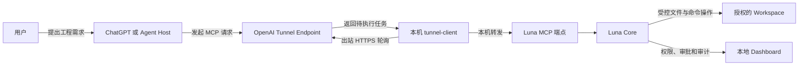

# Luna Unlimited

[](LICENSE)

让 ChatGPT 或其他兼容 MCP 的 Agent，在用户授权和本地安全策略约束下，读取、创建、修改并验证本机工程。

Luna Unlimited 是一个 **AI-neutral / vendor-neutral Local Agent Capability Runtime**。它不是网页逆向代理，也不转发 ChatGPT Cookie；模型继续运行在原来的 Host 中，Luna 只负责把本机 workspace 的受控能力通过 MCP 暴露出去。

> [!IMPORTANT]
> 这是社区项目，不是 OpenAI 官方产品。Secure MCP Tunnel 和 `tunnel-client` 来自 OpenAI；Luna Unlimited 的本地 Core、工具、安全策略和 Dashboard 由本项目提供。

## 它解决什么问题

普通网页对话只能告诉你“应该怎样改代码”，不能直接在你的电脑上完成工程。Luna Unlimited 把这条链路补上：



网页端负责理解需求、规划和调用工具；本机负责限制目录、校验版本、执行文件操作和允许的开发命令。MCP Server 不需要公网端口，`tunnel-client` 通过出站 HTTPS 拉取任务并把结果送回 OpenAI。

## 当前可以做什么

- 浏览、分段读取和搜索工程文件；
- 完整读取同时返回正文与 SHA-256/mtime 元数据，兼容偏好文本或结构化结果的 Host；
- 获取 SHA-256 文件 revision，避免多个 Agent 互相覆盖；
- 原子创建或更新最多 50 个文件，失败时回滚；
- 受控安装 npm 依赖，强制禁用 lifecycle scripts；
- 运行白名单内的 Git、Go、npm build/test/lint/typecheck 命令；
- 命令侧项目发现不会越过授权 workspace：Git 仓库、npm manifest 和 Go module 必须位于授权边界内；
- 文件搜索不会继承 workspace 父目录仓库的 ignore 规则；
- 在本机 Dashboard 查看权限、运行状态、审批队列和审计日志；
- 拒绝绝对路径、`..`、符号链接逃逸、`.env`、私钥和常见凭据文件。

当前版本提供 11 个 MCP 工具：

| 分类 | 工具 |
| --- | --- |
| 能力发现 | `get_capabilities` |
| 浏览与读取 | `list_directory`, `stat_path`, `read_text_file`, `read_text_file_range`, `search_files` |
| 写入 | `write_text_file`, `replace_text`, `write_files` |
| 执行 | `exec_command`, `install_dependencies` |

## 五分钟开始

运行环境：Windows 10/11、PowerShell、Node.js 20 或更高版本，以及能够使用 OpenAI Secure MCP Tunnel 与 ChatGPT Developer mode 的账号/工作区。

```powershell
git clone https://github.com/terrywang1985/luna_unlimited.git
cd luna_unlimited

# 安装 npm 依赖、下载官方 tunnel-client、校验 SHA-256，并创建 .env
.\install.ps1

# 编辑 .env，填入 CONTROL_PLANE_API_KEY 和 CONTROL_PLANE_TUNNEL_ID
notepad .env

# 新建一个专门给 Agent 使用的目录
New-Item -ItemType Directory -Force "C:\luna-workspaces\my-project"

# 启动 MCP、Tunnel 和本地观察页
.\start-all.ps1 -Workspace "C:\luna-workspaces\my-project"
```

然后在 ChatGPT 中开启 Developer mode，创建 Tunnel 类型的插件，选择刚创建的 Tunnel。首次对话建议先说：

```text
请使用 luna-unlimited。先调用 get_capabilities，然后在当前 workspace 中创建一个带测试的 Node.js 项目；
已有文件必须先 stat/read，批量文件优先使用 write_files，安装依赖后运行测试并修复到通过。
```

完整的账号配置、截图、启动说明、调用流程、安全模型、项目示例和故障排查见：

## [安装与使用完整教程](docs/INSTALL_AND_USAGE.md)

## 启停与状态

```powershell
# 重复运行是安全的：旧的 Luna 进程会被识别并停止，再启动一组新进程
.\start-all.ps1 -Workspace "C:\luna-workspaces\my-project"

# 不自动打开 Dashboard
.\start-all.ps1 -Workspace "C:\luna-workspaces\my-project" -NoBrowser

# 停止 MCP 和 Tunnel
.\stop-all.ps1
```

默认地址：

- MCP：`http://127.0.0.1:18765/mcp`
- Dashboard：`http://127.0.0.1:18765/admin`
- 健康检查：`http://127.0.0.1:18765/healthz`

诊断 OpenAI 凭据、Tunnel 配置和本机 MCP 连通性：

```powershell
.\doctor.ps1
```

端口和限制可以在 `.env` 中修改。`MCP_PORT` 必须为 `10001–65535`；修改后 `MCP_SERVER_URL` 中的端口也必须同步。

## 安装脚本的安全行为

`install.ps1` 是幂等的：

1. 检查 Node.js 版本；
2. 只有 npm 依赖缺失或不完整时才执行 `npm ci --ignore-scripts`；
3. 只有 `tunnel-client.exe` 缺失时才查询 OpenAI 官方 GitHub Release；
4. 根据 Windows x64/arm64 下载对应压缩包；
5. 使用同一 Release 的 `SHA256SUMS.txt` 校验后才安装；
6. `.env` 不存在时从 `.env.example` 创建，绝不覆盖已有密钥。

需要主动升级 Tunnel 客户端时，先停止服务再执行：

```powershell
.\stop-all.ps1
.\install.ps1 -ForceTunnelDownload
.\start-all.ps1 -Workspace "C:\luna-workspaces\my-project"
```

## 安全边界

默认只授权一个 workspace。请不要把整个用户目录、磁盘根目录或包含大量秘密的目录作为 workspace。

本地审批默认是 `observe-only`，因为 ChatGPT Host 本身会对工具调用进行确认；你也可以在 Dashboard 开启第二层本地审批。写文件、批量写入、执行命令和安装依赖都会进入审计日志。

`npm test` / `npm run build` 会执行 workspace 中的可变项目脚本，它们不是天然安全命令。面对不可信提示或工程时，请开启本地审批并在 Dashboard 检查操作目标。

从 v0.3.1 起，文件搜索不再继承 workspace 父目录的 ignore 规则；Git 不再向 workspace 父目录寻找 `.git`；npm/Go 命令要求所选 `cwd` 直接包含 `package.json`/`go.mod`；同时会过滤可重定向 Git、Node/npm 和 Go 执行行为的继承环境变量。项目本身的脚本仍属于可变代码，不能因此视为低风险。

从 v0.3.2 起，`read_text_file` 在 MCP 可见文本和结构化结果的 `text` 字段中都返回完整正文；结构化结果同时保留 path、bytes、mtime 和 SHA-256。审计日志只记录元数据，不保存正文。

## 开发与验证

```powershell
npm test
npm run test:mcp
npm run test:admin
npm run test:workspace
```

架构说明和后续能力见 [AGENT_CAPABILITIES_ROADMAP.md](AGENT_CAPABILITIES_ROADMAP.md)。

## 许可证

本项目以 [Apache License 2.0](LICENSE) 发布，版权声明见 [NOTICE](NOTICE)。允许商业使用、修改和再分发；再分发时须遵守许可证中的署名、变更声明和 NOTICE 保留要求。

从 OpenAI 官方 Release 单独下载的 `tunnel-client` 以及 npm 依赖继续遵守各自许可证，不因本项目采用 Apache-2.0 而改变。

## 官方参考

- [OpenAI Secure MCP Tunnel](https://developers.openai.com/api/docs/guides/secure-mcp-tunnels)
- [OpenAI：构建 MCP Server](https://developers.openai.com/plugins/build/mcp-server)
- [OpenAI Platform Tunnel 设置](https://platform.openai.com/settings/organization/tunnels)
- [ChatGPT Plugins](https://chatgpt.com/plugins)
- [OpenAI tunnel-client 最新 Release](https://github.com/openai/tunnel-client/releases/latest)
