# Luna Unlimited 安装与使用完整教程

这份教程面向第一次接触 MCP 的用户。完成后，你可以在 ChatGPT 网页中选择 `luna-unlimited`，让 Agent 在你明确授权的本机目录中创建、修改、安装依赖并测试一个中等规模工程。

> [!WARNING]
> 本项目会向 AI 开放本地文件写入和受控命令执行能力。请使用专门的 workspace，不要授权整个用户目录或磁盘根目录；不要把 API Key、Cookie、SSH 私钥等放进 workspace。

## 1. 项目目的

Luna Unlimited 的目标不是把 ChatGPT 网页伪装成 API，也不是让一个共享账号代理给其他人。它解决的是“模型会思考，但网页无法直接操作本机工程”这一段能力缺口。

系统分为四层：

1. **Agent Host**：ChatGPT、Codex、Claude Code 或其他 MCP 客户端负责理解用户意图和规划；
2. **Secure MCP Tunnel**：OpenAI 托管 endpoint 与本机 `tunnel-client` 建立出站通道；
3. **Luna Core**：执行路径限制、敏感文件保护、权限、审批、审计和并发冲突检查；
4. **Workspace**：用户明确授权给 Agent 的本机目录。

核心原则是：**模型可以更换，Host 可以更换，协议适配器可以更换，本机安全边界不能跟着模型变化。**

## 2. 从网页到本机到底发生了什么

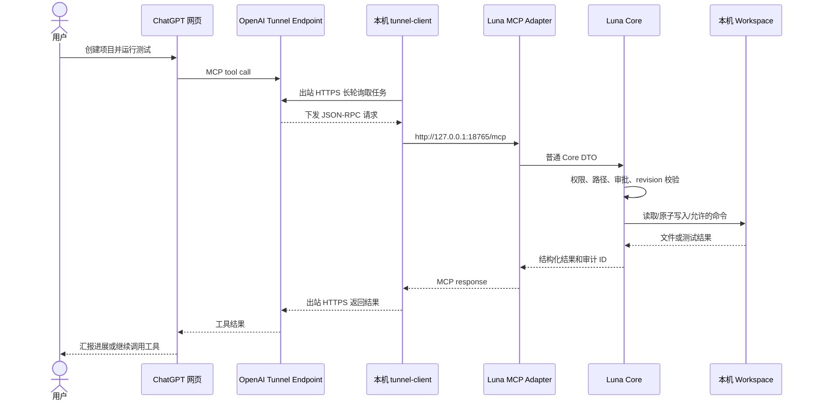

几个重要事实：

- 本机 MCP 只监听 `127.0.0.1`，不需要路由器端口映射；
- `tunnel-client` 主动连接 OpenAI 的 `443` 端口；
- OpenAI Runtime API Key 只给 `tunnel-client` 使用，不写入网页对话；
- ChatGPT 的确认界面是 Host 层确认，Luna Dashboard 还可以开启第二层本地审批；
- 所有真正的路径和权限判断都在本机 Core 中执行。

## 3. 准备条件

### 3.1 本机环境

- Windows 10/11 x64/arm64，或主流 x64/arm64 Linux；
- Windows 使用 PowerShell 5.1/7；Linux 使用 Bash 4.3+；
- [Node.js](https://nodejs.org/) 20 或更高版本；
- Git（用于克隆仓库，非运行必需）；
- 可以访问 `github.com`、`api.github.com` 和 `api.openai.com:443` 的网络；
- Linux 安装脚本还需要 `curl`、`unzip`、`sha256sum`、`realpath`，Ubuntu/Debian 可运行 `sudo apt-get install -y curl unzip coreutils util-linux`。

检查版本：

```powershell
node --version
npm --version
git --version
```

### 3.2 OpenAI 侧权限

根据 OpenAI 官方文档，你需要：

- 一个 Platform `tunnel_id`；
- 一个供 `tunnel-client` 使用的 Runtime API Key；
- Tunnel 的 **Read + Use** 权限；创建/修改 Tunnel 还需要 **Manage**；
- ChatGPT 中可用的 Developer mode。

ChatGPT Developer mode 与 Platform Tunnel 权限是两套独立权限。不同套餐、个人账号和企业工作区的入口可能不同；以账号当前界面和管理员策略为准。官方说明见 [Secure MCP Tunnel](https://developers.openai.com/api/docs/guides/secure-mcp-tunnels)。

## 4. 创建 Runtime API Key

打开 [OpenAI Platform API Keys](https://platform.openai.com/settings/organization/api-keys)。在 API Keys 页面点击 **Create new secret key**。

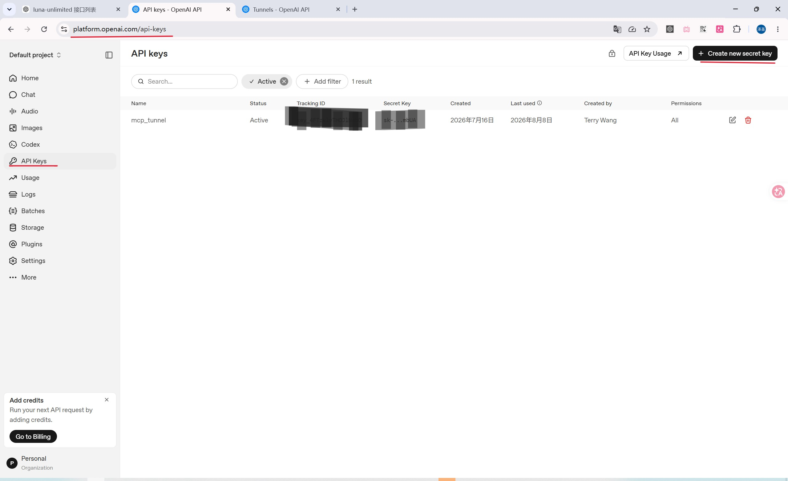

填写一个容易识别的名称，例如 `mcp_tunnel`。权限遵循最小授权原则；具体可选项取决于当前组织策略。

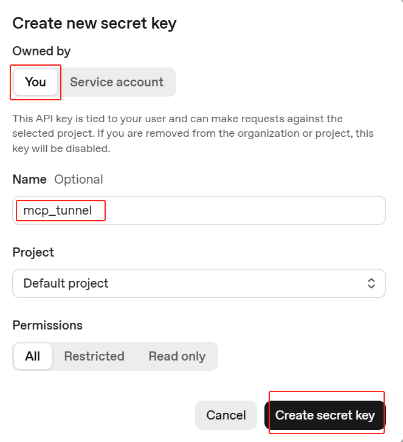

创建后立即复制并保存。这个值只显示一次。

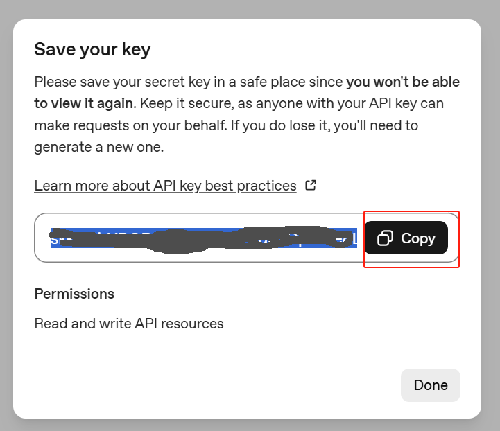

把它放进项目根目录的 `.env`：

```dotenv
CONTROL_PLANE_API_KEY=你的_runtime_api_key
```

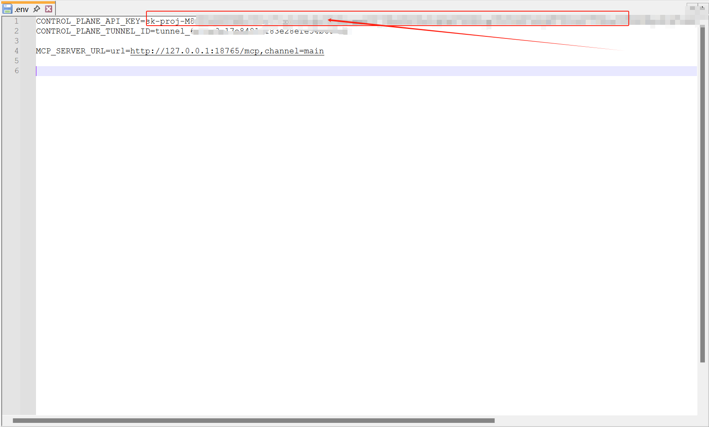

> [!CAUTION]
> `.env` 已被 `.gitignore` 排除。不要把真实 API Key 粘贴到 README、issue、聊天记录或 Git 提交中。怀疑泄露时立即撤销并重新创建。

## 5. 创建 Secure MCP Tunnel

进入 [OpenAI Platform Tunnel 设置](https://platform.openai.com/settings/organization/tunnels)，点击 **Create tunnel**。

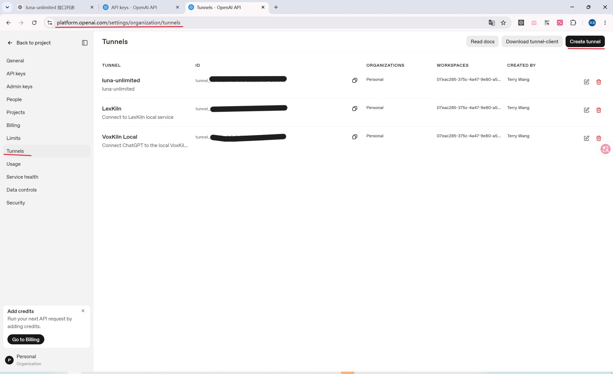

填写名称和说明。必须关联将使用它的 Platform Organization；如果希望在 ChatGPT 中看到它，还要关联目标 ChatGPT workspace。

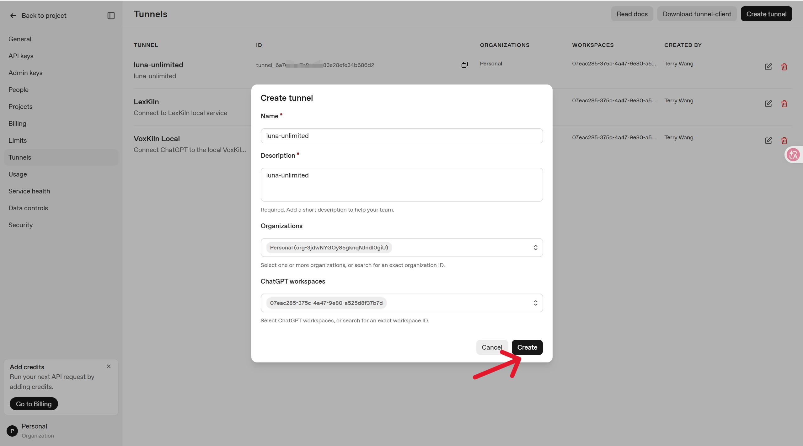

创建后复制 `tunnel_id`。

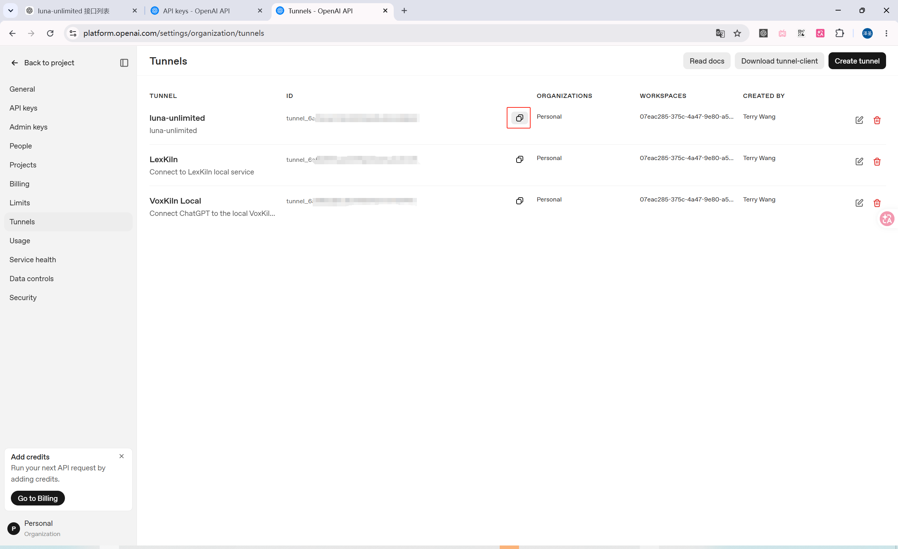

把它写进 `.env`：

```dotenv
CONTROL_PLANE_TUNNEL_ID=tunnel_xxxxxxxxxxxxxxxxxxxxxxxx
MCP_SERVER_URL=url=http://127.0.0.1:18765/mcp,channel=main
MCP_PORT=18765
```

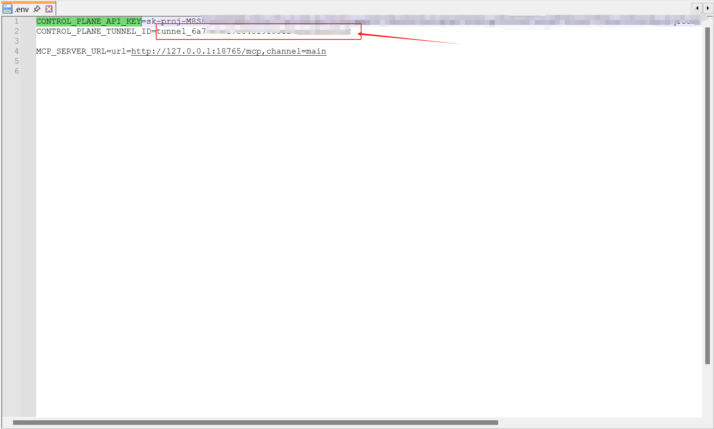

`MCP_SERVER_URL` 是 `tunnel-client` 在本机转发到的 MCP 地址，不是公网 URL。如果修改 `MCP_PORT`，这里的端口也必须同步修改。

## 6. 下载项目与一键安装

Windows：

```powershell
git clone https://github.com/terrywang1985/luna_unlimited.git
cd luna_unlimited
Set-ExecutionPolicy -Scope Process Bypass
.\install.ps1
```

Linux：

```bash
git clone https://github.com/terrywang1985/luna_unlimited.git
cd luna_unlimited
bash ./install.sh
nano .env
chmod 600 .env
```

安装脚本会：

1. 检查 Node.js 20+；
2. 使用 `package-lock.json` 安装确定版本的 npm 依赖；
3. 禁用 npm lifecycle scripts；
4. 从 OpenAI 官方 [`openai/tunnel-client`](https://github.com/openai/tunnel-client/releases/latest) 最新 Release 下载匹配的 Windows/Linux x64/arm64 版本；
5. 用官方 `SHA256SUMS.txt` 验证压缩包；
6. 创建 `.env`，但不会覆盖已有 `.env`。

Linux 的 `.env` 由脚本按 `NAME=value` 严格解析，不会执行 `source .env`，因此配置值不会被当成 Shell 命令。脚本会检查文件权限；建议始终保持 `chmod 600 .env`。

反复执行 `install.ps1` 不会重复下载已存在的 Tunnel 客户端，也不会覆盖密钥。需要升级客户端时：

```powershell
.\stop-all.ps1
.\install.ps1 -ForceTunnelDownload
```

Linux 对应命令：

```bash
bash ./stop-all.sh
bash ./install.sh --force-tunnel-download
```

## 7. 完整 `.env` 示例

```dotenv
CONTROL_PLANE_API_KEY=replace_with_your_runtime_api_key
CONTROL_PLANE_TUNNEL_ID=tunnel_replace_with_your_tunnel_id
MCP_SERVER_URL=url=http://127.0.0.1:18765/mcp,channel=main

MCP_HOST=127.0.0.1
MCP_PORT=18765
MCP_MAX_FILE_BYTES=1048576
MCP_MAX_BATCH_BYTES=8388608
MCP_MAX_COMMAND_OUTPUT_BYTES=262144
MCP_MAX_CHECKPOINT_FILES=5000
MCP_MAX_CHECKPOINT_BYTES=134217728
MCP_MAX_CHECKPOINTS=20
MCP_MAX_ARTIFACT_BYTES=26214400
MCP_MAX_OPERATION_ENTRIES=10000
```

变量说明：

| 变量 | 用途 | 默认/建议 |
| --- | --- | --- |
| `CONTROL_PLANE_API_KEY` | Tunnel 控制面认证 | 必填，保密 |
| `CONTROL_PLANE_TUNNEL_ID` | OpenAI 托管 Tunnel 身份 | 必填，`tunnel_...` |
| `MCP_SERVER_URL` | Tunnel 转发目标 | `127.0.0.1:18765/mcp` |
| `MCP_HOST` | MCP 监听地址 | 保持 `127.0.0.1` |
| `MCP_PORT` | MCP 与 Dashboard 端口 | `18765`，要求大于 10000 |
| `MCP_MAX_FILE_BYTES` | 单文件上限 | 1 MiB |
| `MCP_MAX_BATCH_BYTES` | 一次原子批量写入上限 | 8 MiB |
| `MCP_MAX_COMMAND_OUTPUT_BYTES` | stdout/stderr 单项保留上限 | 256 KiB |
| `MCP_MAX_CHECKPOINT_FILES` | 单个恢复点最多文件/目录数 | 5000 |
| `MCP_MAX_CHECKPOINT_BYTES` | 单个恢复点内容上限 | 128 MiB |
| `MCP_MAX_CHECKPOINTS` | 每个 workspace 最多恢复点 | 20 |
| `MCP_MAX_ARTIFACT_BYTES` | 单个导入、检查或导出的二进制文件上限 | 25 MiB |
| `MCP_MAX_OPERATION_ENTRIES` | 单次递归移动/删除最多扫描条目 | 10000 |
| `LUNA_STATE_DIR` | 可选私有状态目录，必须在 workspace 外 | 系统用户状态目录 |
| `LUNA_TUNNEL_RUNTIME_ALIAS` | Linux managed runtime 的实例别名 | `luna-unlimited` |
| `LUNA_EXECUTION_PROFILE` | 系统命令档位：`restricted/user/container-root/host-root` | `restricted` |

## 8. 选择安全的 Workspace 并启动

Workspace 是 AI 唯一可以访问的目录。推荐为每个工程建立独立目录：

Windows：

```powershell
New-Item -ItemType Directory -Force "C:\luna-workspaces\medium-app"
.\start-all.ps1 -Workspace "C:\luna-workspaces\medium-app"
```

Linux：

```bash
mkdir -p "$HOME/luna-workspaces/medium-app"
bash ./start-all.sh --workspace "$HOME/luna-workspaces/medium-app"
```

默认 `restricted` 禁用 `system.execute`。需要让 Agent 运行普通用户命令、容器内 root 命令或宿主机 root 命令时，必须由机器所有者显式启动对应档位：

```bash
bash ./start-all.sh --workspace "$HOME/luna-workspaces/medium-app" --execution-profile user
bash ./start-all.sh --workspace /workspace --execution-profile container-root
sudo bash ./start-all.sh --workspace /srv/luna-workspace --execution-profile host-root
```

`user` 在 Linux 上拒绝 UID 0；两个 root 档位会分别验证 UID 0 和容器/宿主机环境。远端 Agent 与 Dashboard 都不能升级执行档位。默认 `LUNA_SYSTEM_APPROVAL_MODE=host`：`system.execute` 由 ChatGPT/Host 页面确认后直接执行，不再要求终端或 Dashboard 二次批准。需要双重审批时，在 `.env` 设置 `LUNA_SYSTEM_APPROVAL_MODE=host-and-local`。多租户产品只应在非 privileged、无 Docker socket、无宿主机目录挂载的隔离容器中启用 `container-root`。

Linux 服务器不需要公网 IP，也不要把 `MCP_PORT` 暴露到公网。MCP 与 Dashboard 继续仅监听 `127.0.0.1`；Tunnel 只需要访问 OpenAI `443` 的出站网络。若要从自己的电脑观察远程 Dashboard，可使用 SSH 端口转发：

```bash
ssh -L 18765:127.0.0.1:18765 user@linux-server
```

然后在本机浏览器打开 `http://127.0.0.1:18765/admin`。

脚本会依次：

1. 幂等检查安装；
2. 只停止由本项目 PID 文件确认的旧进程；
3. 启动本机 MCP；
4. 等待 `/healthz`；
5. 启动 Tunnel 客户端；Linux 使用其 managed runtime 监督机制；
6. 等待 Tunnel 同时达到 running、healthy、ready；
7. Windows 默认打开 Dashboard，Linux 仅在传入 `--open-browser` 时打开。

启动成功后：

```text
MCP:       http://127.0.0.1:18765/mcp
Dashboard: http://127.0.0.1:18765/admin
```

再次运行同一个命令不会产生重复进程。切换工程时，只需要传入另一个已经存在的目录。

不自动打开浏览器：

```powershell
.\start-all.ps1 -Workspace "C:\luna-workspaces\medium-app" -NoBrowser
```

Linux 默认不打开浏览器；桌面环境需要自动打开时：

```bash
bash ./start-all.sh --workspace "$HOME/luna-workspaces/medium-app" --open-browser
```

停止：

```powershell
.\stop-all.ps1
```

```bash
bash ./doctor.sh
bash ./stop-all.sh
```

只启动和停止 MCP Server，不启动、不停止、不重新配置 Tunnel：

```bash
bash ./start-server.sh --workspace "$HOME/luna-workspaces/medium-app"
bash ./start-server.sh --workspace /srv/luna-workspace --execution-profile host-root
bash ./stop-server.sh
```

MCP-only 脚本只读取 `MCP_*`、`LUNA_STATE_DIR` 和 workspace 配置，不要求 `.env` 中存在 Runtime API Key、Tunnel ID 或 `MCP_SERVER_URL`。这适合先在 Linux 上检查 Dashboard/MCP Inspector，或者在 Tunnel 已由其他方式管理时单独重启 Luna Core。`stop-server.sh` 只停止经过 PID、Node 可执行文件和 `src/server.mjs` 命令行共同确认的进程，不触碰 Tunnel managed runtime。

## 9. 在 ChatGPT 开启 Developer mode

进入 ChatGPT 的 **Settings**。

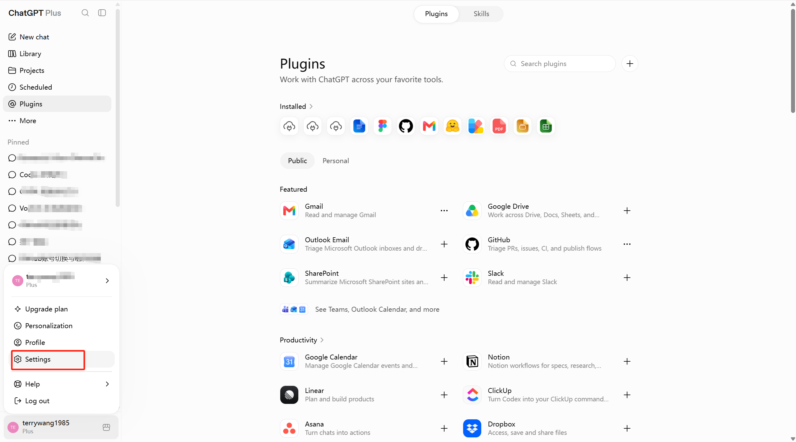

在 **Security and login** 中开启 **Developer mode**。界面会提示自定义 MCP 具备较高风险，这是正常的安全提醒。

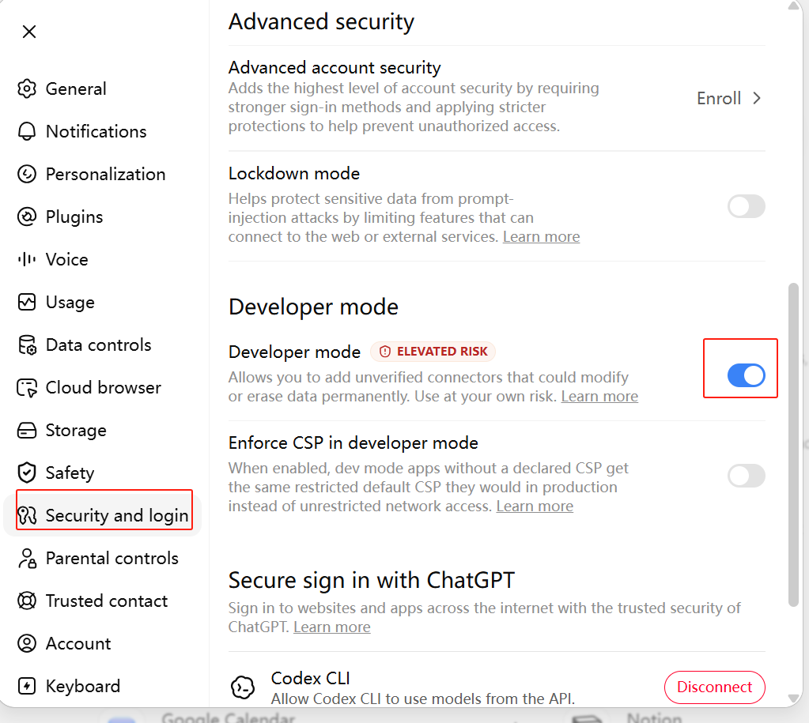

如果没有这个开关：

- 确认当前账号/工作区支持 Developer mode；
- Enterprise/Edu 用户联系工作区管理员；
- 确认 Platform Tunnel 已关联目标 ChatGPT workspace；
- 等待 RBAC 权限传播后重新登录。

## 10. 创建 ChatGPT 插件

打开 [ChatGPT Plugins](https://chatgpt.com/plugins)，点击加号创建插件：

1. Name 填 `luna-unlimited`；
2. Connection 选择 **Tunnel**；
3. 选择已创建的 Tunnel，或使用 Tunnel ID；
4. Authentication 选择本项目当前使用的 `No Auth`；
5. 阅读风险提示并确认；
6. 点击 **Create**。

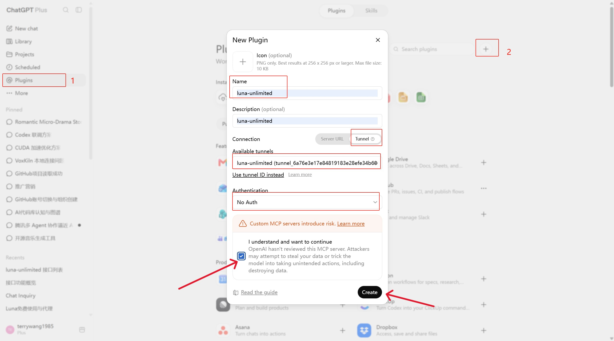

如果插件扫描后没有看到 v0.7.0 的 13 个领域工具，先确认本机 MCP/Tunnel Ready，然后删除或刷新开发插件并新开一个对话。v0.7.0 删除了全部旧平铺工具，已有会话可能仍缓存旧目录。

## 11. 在网页中使用 Luna

在新对话输入框点击 `+` 或输入 `@luna`，选择 `luna-unlimited`。

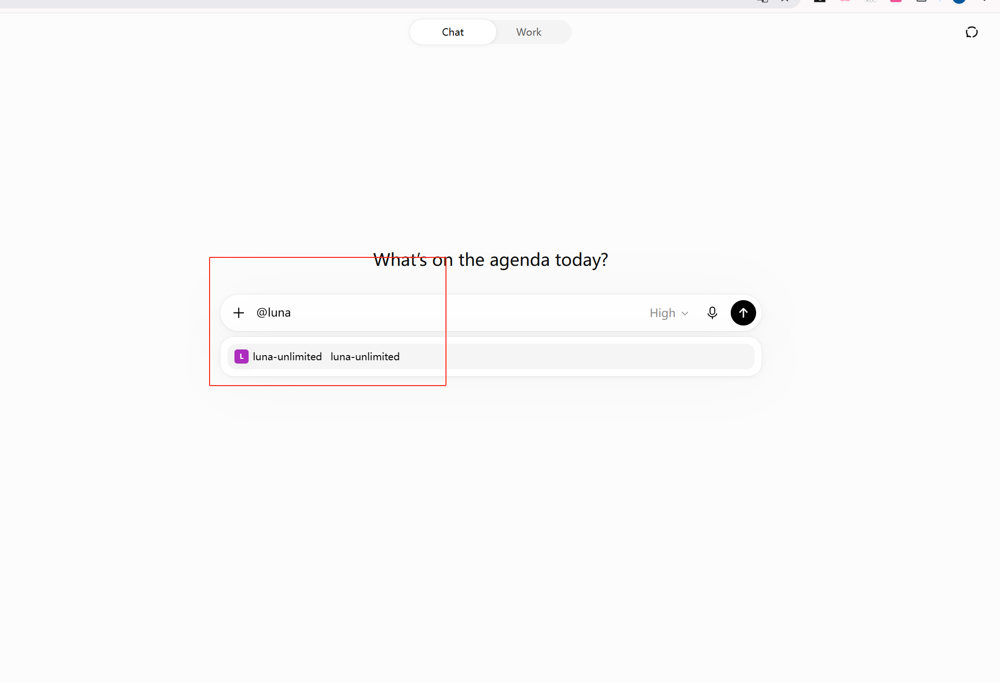

选中后直接描述工程目标：

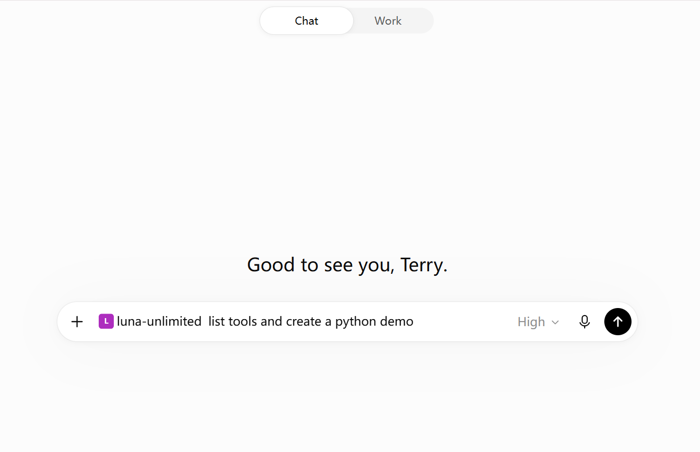

推荐的第一条完整指令：

```text
使用 luna-unlimited 在当前 workspace 创建一个中等规模的 Node.js 项目。

要求：
1. 先调用 luna.capabilities，确认工具、子操作和限制；
2. 先调用 workspace.read(list)；已有文件必须用 stat/text 操作检查后再修改；
3. 给出目录结构和实现计划；
4. 新建完整文件优先使用 workspace.write(many)；修改已有代码优先使用带 SHA-256 预期的 code.patch；
5. 创建 package.json、源码、测试、README 和必要配置；
6. 使用 project.dependencies 安装声明的 npm 依赖；
7. 使用 project.execute 运行 lint/typecheck/test/build 中项目实际提供的命令；
8. 根据错误继续修改，直到测试通过；
9. 最后汇报创建文件、测试结果、仍存在的风险，不读取任何敏感文件。
```

建议从 Node.js、TypeScript、静态网站或 Go 工程开始。当前可以创建 Python 文件，但默认命令白名单不允许任意执行 Python；这是安全限制，不是模型能力问题。

如果从公开 GitHub 项目开始，可以先调用：

```text
git.remote({
  "request": {
    "operation": "clone",
    "url": "https://github.com/owner/repository",
    "destination": "repository",
    "ref": "main",
    "depth": 1
  }
})
```

目标必须是 workspace 内尚不存在的新目录。当前只支持公开 `github.com` HTTPS 仓库；不接受 SSH、`file://`、其他 Host、非 443 端口、重定向或 URL 内的账号/token。Private 仓库需要未来的 OAuth/Secret Broker，不能把 PAT 拼进 URL。

## 12. Agent 创建工程的可靠工作流

Luna 的推荐工作流不是“直接覆盖所有文件”，而是：

```text
luna.capabilities
    ↓
git.remote(clone)（仅从公开 GitHub 项目开始时）
    ↓
workspace.read(list/search/stat/text/range)
    ↓
制定目录结构与文件批次
    ↓
workspace.write(many) / code.patch(expected_files, dry_run)
    ↓
project.dependencies
    ↓
project.execute(test/build/lint/typecheck)
    ↓
读取错误 → 重新 stat/read → 修复 → 再测试
```

### `workspace.read(text)` 返回什么

`workspace.read` 的 `text` 操作适合读取上限以内的完整 UTF-8 小文件。正文会同时出现在 MCP 文本内容和结构化结果的 `text` 字段；结构化结果还包含 path、bytes、mtime 与 SHA-256。审计只保存元数据，不保存文件内容。

大文件或只需要局部上下文时使用 `workspace.read(range)`，单次最多读取 1000 行。

### 大规模修改前先创建恢复点

在重构或批量生成文件前调用：

```text
checkpoint.write({"request":{"operation":"create","label":"before-auth-refactor"}})
```

恢复点使用非 Git `local-snapshot` 后端，因此空目录、未初始化 Git 的项目同样可用。若方向错误：

```text
checkpoint.read()
checkpoint.write({"request":{"operation":"restore","checkpoint_id":"cp_..."}})
```

恢复会还原快照内文件并删除之后新增的普通文件；`.git`、`.env` 等敏感路径、`node_modules` 和 Luna 运行日志被明确排除并原样保留。恢复取得 workspace 独占写锁，失败时自动回到恢复操作开始前的状态。确认不再需要后使用 `checkpoint.write(delete)` 删除私有快照。

快照内容依赖操作系统当前用户的私有目录权限，不额外加密；共享系统账号或高敏源码环境应自行加密磁盘，并及时删除不再需要的恢复点。

### 为什么已有文件必须先 `workspace.read(stat)`

`workspace.read(stat)` 返回 SHA-256 revision。`workspace.write(many)` 更新已有文件时必须携带该值。如果用户或另一个 Agent 已经改过文件，写入会得到 `FILE_CHANGED`，Agent 必须重新读取，而不是覆盖新版本。

### 为什么使用 `workspace.write(many)`

创建工程通常涉及 `package.json`、源码、测试和配置。`workspace.write(many)` 会先验证整批路径、敏感规则、文件大小和 revision，再进入 commit；任一步失败会回滚已经提交的文件，避免出现“写了一半的工程”。

### 为什么修改代码优先使用 `code.patch`

`code.patch` 接受统一的 unified diff，一次最多触及 50 个文件，并支持创建、修改和删除。每个路径都必须出现在 `expected_files`：已有文件填写刚由 `workspace.read(stat)` 获得的 SHA-256，新文件填写 `null`。建议先使用 `dry_run=true`，确认 context、revision、路径和大小全部通过，再用相同 patch 正式提交。

```text
workspace.read({"request":{"operation":"stat","path":"src/app.mjs"}})
code.patch(
  patch="--- a/src/app.mjs ...",
  expected_files=[{"path":"src/app.mjs","sha256":"<stat 返回值>"}],
  dry_run=true
)
```

Core 在文件锁内先解析整份 diff，并在内存中生成全部目标内容；只有全部验证通过才写盘。提交过程中任一文件失败，会恢复此前已经变更的文件。审计事件用 `validation`、`dry_run`、`committed`、`rollback` 区分阶段，但不保存 diff 正文。v0.5.0 暂不支持 binary patch、rename/copy patch、quoted Git path，以及缺少末尾换行的文本文件；这些情况会明确失败，不会部分提交。

### 文件重构与删除

`workspace.write(mkdir)` 可以显式创建目录；`workspace.manage(move)` 支持文件和安全目录的原子移动；`workspace.manage(delete)` 删除文件或目录。移动和删除文件前必须先 `workspace.read(stat)` 或 `artifact.read(inspect)`，并传入 SHA-256。覆盖目标文件还需要 `expected_destination_sha256`。非空目录删除必须使用 `recursive=true`，建议先创建 checkpoint。

递归目录操作会拒绝 `.git`、`.env`、凭据文件、内部临时文件和任何符号链接，并有条目数量上限。workspace 根不能移动或删除。`workspace.manage(delete)` 和覆盖移动都属于高风险操作，会受本地权限、审批和审计控制。

### PDF、Excel 和图片 Artifact

二进制文件不要传给文本读取操作，改用：

```text
artifact.read({"request":{"operation":"inspect","path":"assets/mockup.png"}})
artifact.read({"request":{"operation":"export","path":"reports/result.pdf"}})
artifact.import(file=<网页文件参数>, destination="assets/generated.png", expected_sha256=null)
```

`artifact.import` 当前允许 PDF、XLS/XLSX、PNG、JPEG、GIF、WebP。ChatGPT Adapter 按 [OpenAI File APIs 参考](https://developers.openai.com/plugins/reference#file-apis) 使用官方 `_meta["openai/fileParams"]` 接收 `file_id` 和临时 `download_url`，随后 Core 执行 HTTPS/公网地址、重定向、大小、扩展名、MIME 和文件签名检查，并用临时文件原子提交。不能把任意 URL 当下载器使用。

ChatGPT 生成物和用户附件都必须作为实际 Host 文件传给 `artifact.import.file`，不要把界面上看到的 `file_id` 手工复制成普通字符串。`file` 继续保持顶层字段并声明 `openai/fileParams`；Host 会在请求抵达 MCP 前沿该路径补齐 `download_url` 和 `file_id`。网页 `/mnt/data/...` 路径和裸 ID 永远不会被 Luna Core 当成本地路径或下载凭据。

`artifact.read(export)` 返回标准 MCP `resource_link`；链接只在短时间内有效并绑定当前 SHA-256，文件变化后旧链接立即失效。不同 Host 对资源链接的展示方式可能不同。Excel 单元格级读写、PDF 文本提取/渲染将在后续文档处理层实现。

### 依赖安装为什么单独提供工具

任意 shell 权限过大。`project.dependencies` 当前只接受 npm，强制公共 registry，并关闭 lifecycle scripts、audit 和 fund hook。网络下载第三方包仍有供应链风险，因此对应的 `project.install_dependencies` Action 受审批保护。

### 仓库 Clone 为什么单独提供工具

`git.remote(clone)` 不通过 `project.execute` 放开任意 `git clone`。Core 会验证公开 GitHub URL、DNS、公网 Host、目标目录和 ref，关闭凭据助手、交互认证、代理、重定向、LFS smudge 与子模块初始化，并限制深度、超时、文件数和字节数。仓库先写入随机临时目录，校验成功后原子移动到目标；对应的 `git.clone` Action 是 `network + write` 风险。

## 13. Dashboard、权限、审批和日志

打开：

```text
http://127.0.0.1:18765/admin
```

Dashboard 可以查看：

- MCP 是否 Ready；
- Tunnel 是否 Ready；
- 当前授权 workspace；
- 13 个公开领域工具对应的 26 个 Action 启用状态；
- 待审批操作；
- 最近读写、执行、拒绝和错误日志。

本地审批默认关闭，即 `observe-only`。开启后，受保护的细粒度 Action（例如 `workspace.write_text`、`workspace.delete`、`code.apply_patch`、`checkpoint.restore`、`git.clone` 和 `project.install_dependencies`）会等待 Dashboard 决定。只读 Action 不会因为与写操作共享一个领域 Tool 而被提升权限。

审批默认 120 秒超时拒绝。Dashboard 和审计不会保存待写入正文或 API Key。

## 14. 安全模型与使用建议

### Luna 会强制执行

- 只能访问启动时授权的 workspace；
- 拒绝绝对路径和 `..` 逃逸；
- 拒绝符号链接逃逸；
- 隐藏并拒绝 `.git`、`.env`、私钥和常见凭据；
- 文件、批次、命令输出和超时限制；
- 开发命令使用 `program + args[]` 和 `shell=false`；
- 名称含 key/token/secret/password/cookie/auth/credential 的环境变量不会传给命令；
- Git 仓库发现止步于 workspace，且会校验 worktree、git dir 和 common dir 都在授权边界内；
- ripgrep 文件/内容搜索不会读取 workspace 父目录的 ignore 规则；
- npm/Go 命令要求 `cwd` 直接包含 `package.json`/`go.mod`，不会复用父目录项目；
- Go build/test 禁用自动 toolchain 下载与模块网络获取，只使用本机 toolchain 和已有 module cache；
- Git、Node/npm、Go 的项目重定向和执行控制环境变量会被过滤，并由 Core 注入安全值；
- 公开仓库 Clone 只允许无凭据 `github.com` HTTPS，拒绝重定向和私有网络来源，并在原子提交前检查仓库规模和敏感路径；
- 写入队列、SHA-256 冲突保护、权限、审批和审计。

### 用户仍然需要负责

- 不授权包含个人秘密的宽泛目录；
- 不批准自己不理解的命令；
- 知道 `npm test` 等项目脚本可被工程内容改变；
- 定期检查 Dashboard 和 `logs/audit.jsonl`；
- API Key 泄露后立即撤销；
- 重要工程使用 Git 或额外备份。

## 15. 当前边界

这个版本已经具备创建普通中等规模工程的基础闭环，但不是“无限权限桌面 Agent”。当前尚未提供：

- 任意 PowerShell/cmd/bash；
- arbitrary Python/Rust/.NET/CMake 命令；
- 任意格式、无 revision 保护的文件修改（受控 move/delete 与原子 unified diff patch 已提供）；
- Git push、force push、reset 或凭据操作；
- 长期后台进程和浏览器自动测试；
- 持久化本地 policy。

这些限制是为了先把可审计、可冲突检测的工程创建做好。后续计划见 [能力路线图](../AGENT_CAPABILITIES_ROADMAP.md)。

## 16. 故障排查

### PowerShell 不允许运行脚本

只对当前窗口临时放开：

```powershell
Set-ExecutionPolicy -Scope Process Bypass
```

### `.env` 未配置

重新运行 `install.ps1` 生成模板，然后填写两个必填项：

```powershell
.\install.ps1
notepad .env
```

### 18765 端口被占用

在 `.env` 同时修改：

```dotenv
MCP_PORT=18766
MCP_SERVER_URL=url=http://127.0.0.1:18766/mcp,channel=main
```

然后重新启动。

### MCP Ready，但 Tunnel 不 Ready

检查：

```powershell
Get-Content .\logs\tunnel.log -Tail 100
.\doctor.ps1
```

确认 Runtime API Key、Tunnel ID、组织/工作区关联和出站 `api.openai.com:443`。

### Tunnel Ready，但 ChatGPT 看不到 Tunnel

- Tunnel 必须关联目标 ChatGPT workspace；
- 当前用户需要 Tunnels Read + Use；
- ChatGPT Developer mode 必须开启；
- 企业权限变更可能需要一段时间传播；
- 重新登录或新开会话。

### ChatGPT 只看到旧工具

停止并重新启动 Luna，刷新/重建开发插件，再新开对话：

```powershell
.\stop-all.ps1
.\start-all.ps1 -Workspace "C:\luna-workspaces\medium-app"
```

### 查看本地日志

```powershell
Get-Content .\logs\server.err.log -Tail 100
Get-Content .\logs\tunnel.log -Tail 100
Get-Content .\logs\audit.jsonl -Tail 30
```

## 17. 验证安装

服务启动后，在另一个 PowerShell 窗口执行：

```powershell
npm test
npm run test:mcp
npm run test:admin
npm run test:workspace
npm run test:patch
npm run test:artifact
```

完整测试覆盖旧 7 个工具 contract、路径和敏感文件、权限、审批、审计、SHA-256 冲突、多文件事务、atomic unified diff 的 dry-run/提交/失败回滚、目录并发门、受保护删除、Artifact 签名/SSRF/原子导入/resource link、npm lifecycle scripts、非 Git checkpoint 的完整恢复/失败回滚/损坏拒绝，以及生成工程自身的测试。

## 18. 官方资料

- [Secure MCP Tunnel](https://developers.openai.com/api/docs/guides/secure-mcp-tunnels)
- [MCP and Connectors](https://developers.openai.com/api/docs/guides/tools-connectors-mcp)
- [Build an MCP server](https://developers.openai.com/plugins/build/mcp-server)
- [Platform Tunnel 设置](https://platform.openai.com/settings/organization/tunnels)
- [ChatGPT Plugins](https://chatgpt.com/plugins)
- [openai/tunnel-client Releases](https://github.com/openai/tunnel-client/releases/latest)
